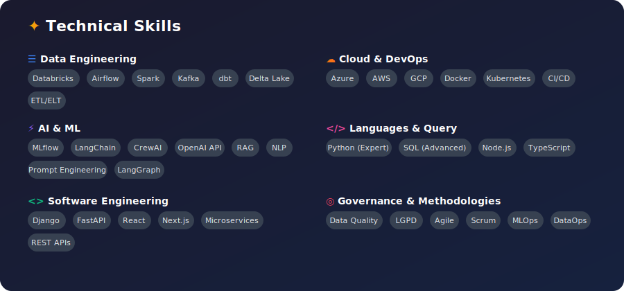

<!-- HEADER BANNER -->


# Alexsander Valente Telles

**Senior AI & Data Engineer** | Building intelligent systems that transform data into decisions

[](https://linkedin.com/in/alexsander-valente)
[](https://alexsander.app.br)
[](https://alexsander.app.br/genai)
[](mailto:alevtelles@gmail.com)

---

## About

```
2014                           2022                           Today
  │                              │                              │
  ▼                              ▼                              ▼
  Software Engineering    ───►   Data & AI Engineering    ───►   AI Systems & MLOps
```

Started in **2014 as a Software Engineer** building web systems, APIs, and enterprise applications. Transitioned to **Data & AI Engineering in 2022**, bringing software engineering discipline to ML systems and data platforms.

---

## Areas of Expertise

**AI Engineering** · Production RAG systems, multi-agent orchestration, LLM evaluation & tuning

**Data Platforms** · Lakehouse architecture, real-time & batch pipelines, data governance

**MLOps** · Reproducible pipelines, experiment tracking, model deployment

**Software Quality** · Clean architecture, CI/CD automation, production-grade code

---

## Machine Learning & MLOps

End-to-end ML pipelines from experimentation to production:

- **Training & Evaluation** · Modular pipelines with reproducible experiments
- **Data & Model Versioning** · DVC for data, MLflow for experiments and model registry
- **Model Serving** · FastAPI endpoints, Docker containers, AWS SageMaker
- **CI/CD for ML** · Automated testing, validation gates, continuous deployment

[]()
[]()
[]()
[]()
[]()
[]()

---

## Tech Stack



---

## Contact

Open to remote opportunities in AI, Data, and MLOps Engineering. Europe, Americas, Global.

📍 Florianópolis, Brazil

[](https://linkedin.com/in/alexsander-valente)
[](https://alexsander.app.br)
[](mailto:alevtelles@gmail.com)
