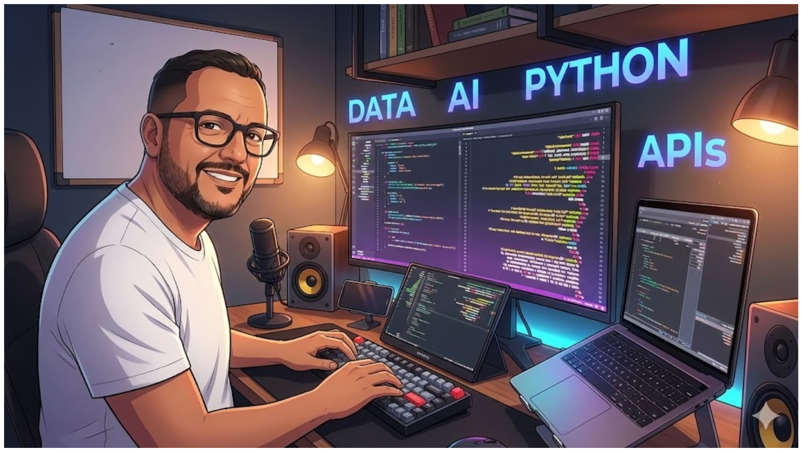

<!-- HEADER BANNER -->



# Alexsander Valente Telles

**Senior AI & Data Engineer** · Building intelligent systems that transform data into decisions.

[](https://linkedin.com/in/alexsander-valente)
[](https://alexsander.app.br)
[](https://alexsander.app.br/genai)

---

## About

I'm a technology professional with **10+ years of experience**, currently focused on **AI Engineering**, **Data Platforms**, and **MLOps**.

My journey started in **2014 as a Software Engineer**, building web systems, APIs, and enterprise applications with Python, JavaScript, and SQL. This foundation gave me a strong understanding of architecture, scalability, and production-grade code.

In **2022**, I transitioned to **Data & AI Engineering**, bringing my software engineering discipline to the data world. Today I design modern data architectures, build LLM-powered applications, and implement ML pipelines that go from experimentation to production.

**Current focus:** Production-grade RAG systems, AI agents, Lakehouse architectures, and reproducible ML pipelines.

---

## Technical Expertise

### AI & Machine Learning
- **LLMs & RAG:** LangChain, LangGraph, CrewAI, OpenAI, Anthropic, Groq
- **Vector Search:** Pinecone, ChromaDB, Qdrant, FAISS, pgvector
- **ML/MLOps:** scikit-learn, MLflow, DVC, SageMaker, model serving

### Data Engineering
- **Platforms:** Databricks, Apache Spark, Delta Lake, Unity Catalog
- **Orchestration:** Airflow, Kafka, dbt
- **Architecture:** Lakehouse, Medallion Pattern, Data Mesh, Streaming

### Software Engineering
- **Backend:** Python, FastAPI, PostgreSQL, Redis, Docker, Kubernetes
- **Frontend:** React, Next.js, TypeScript, Tailwind CSS
- **Cloud:** AWS, Azure, GCP
- **Practices:** CI/CD, GitHub Actions, Clean Architecture, TDD

---

## Featured Work

### Enterprise Systems

**[HR System with AI-Powered Screening](https://github.com/alevtelles/sistema-cadastro-rh)**  
Full-stack recruitment system with 94+ API endpoints, GPT-4 resume analysis, multi-channel notifications, and role-based access control.  
`FastAPI` `Next.js` `OpenAI` `PostgreSQL` `Docker`

**[Investment Consulting Platform](https://github.com/alevtelles/consultoria-investimentos-com-ia)**  
AI-powered investment advisory backend with multi-persona agents and personalized recommendations.  
`FastAPI` `LangChain` `PostgreSQL` `JWT`

### AI Agents & RAG

**[NeoBank Assistant](https://github.com/alevtelles/neobank-assistant)**  
Banking assistant demonstrating the evolution of AI workflows: Non-Agentic → Agentic → Autonomous Agent.  
`LangChain` `LangGraph` `Groq` `ReAct Pattern`

**[Medical RAG Assistant](https://github.com/alevtelles/Assistente-Medico-IA)**  
Clinical decision support system using RAG over medical documents with semantic search and source citation.  
`FastAPI` `Pinecone` `LangChain` `Hybrid Search`

**[Pix Market Agent](https://github.com/alevtelles/agente-crewai-mercado-pix)**  
Multi-agent system analyzing Brazil's Pix ecosystem with real Central Bank data.  
`CrewAI` `Streamlit` `BCB API`

**[Professor Wiki](https://github.com/alevtelles/professor-wiki)**  
Corporate knowledge base with conversational AI, supporting PDF, URL, and YouTube ingestion.  
`LangChain` `ChromaDB` `BM25` `FAISS`

### Data Engineering

**[Lakehouse Pipeline](https://github.com/alevtelles/pipeline-de-ingestao-de-dados)**  
Modern data architecture implementing Medallion pattern (Bronze → Silver → Gold) with Unity Catalog governance.  
`Databricks` `Spark` `Delta Lake` `Data Quality`

**[Sales Analytics Pipeline](https://github.com/alevtelles/pipeline-estabelecimento-vendas)**  
End-to-end data pipeline for business analytics with lineage tracking and reproducible transformations.  
`Databricks` `Spark` `Delta Lake`

---

## MLOps Approach

I believe ML systems should follow the same engineering rigor as traditional software:

- **Reproducibility:** DVC for data versioning, deterministic training pipelines
- **Experiment Tracking:** MLflow for metrics, parameters, and model registry
- **CI/CD:** GitHub Actions with automated testing and validation gates
- **Deployment:** FastAPI for local serving, SageMaker for cloud endpoints
- **Monitoring:** Data drift detection, performance metrics, alerting

---

## Career Timeline

```
2014 ─────────────────── 2022 ─────────────────── Present
     Software Engineering      Data & AI Engineering
     
     • Web Systems             • Lakehouse Architecture
     • APIs & Microservices    • LLMs & RAG Systems
     • Enterprise Apps         • ML Pipelines & MLOps
     • Full-Stack Development  • AI Agents & Automation
```

---

## Open Source & Knowledge Sharing

- 🤖 **[GenAI Hub](https://alexsander.app.br/genai)** — Curated resources on Generative AI
- 📚 **65+ repositories** covering AI, Data Engineering, and Full-Stack development
- 🎯 Focus on production-ready code with comprehensive documentation

---

## Let's Connect

I'm open to remote opportunities in AI, Data, and MLOps Engineering.

- **LinkedIn:** [linkedin.com/in/alexsander-valente](https://linkedin.com/in/alexsander-valente)
- **Website:** [alexsander.app.br](https://alexsander.app.br)
- **Email:** alevtelles@gmail.com

---

<sub>Based in Florianópolis, Brazil 🇧🇷 · Available for global remote work</sub>
